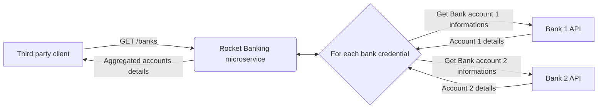

# Rust + Rocket sample project

## Purpose

The purpose of this project is to showcase a functional example of a REST micro-service. It aims to work as an aggregator of multiple bank accounts balances in order to make fast the visualisation of several bank accounts.

The following diagram shows how the service behaves :

:notebook: Each bank credential is provided in the HTTP request header `credentials`. (TODO : wrap credentials in an encrypted token. Not done yet because it is an example project not meant for production).

## Getting started

TODO

## Tests

This project is tested and metrics are available at following location :